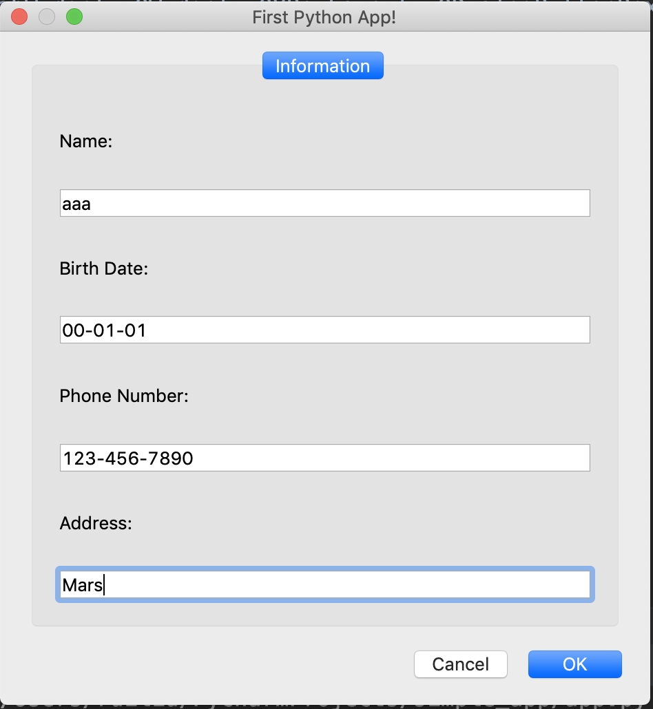

# simple_app
programme based on Pyqt5


## Tool
The tool we are using is called PyQt5. PyQt is a set of Python v2 and v3 bindings for The Qt Company's Qt application framework and runs on all platforms supported by Qt including Windows, OS X, Linux, iOS and Android. PyQt5 supports Qt v5. PyQt4 supports Qt v4 and will build against Qt v5. The bindings are implemented as a set of Python modules and contain over 1,000 classes.(ref:https://riverbankcomputing.com/software/pyqt/intro)
The python package needed is qtpy. QtPy is a small abstraction layer that lets you write applications using a single api call to either PyQt or PySide.

## App Demo
The app is to collect some basic information and print it out.(or you can save it somewhere else)
<br/>

## How to run it
```
python simple_app.py
```

